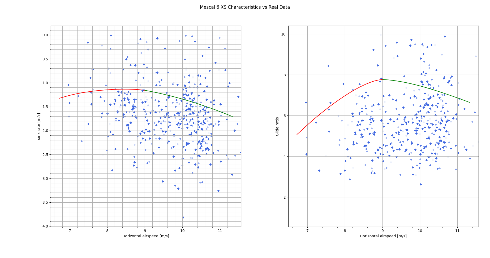

# Paraglider Research

I fly paragliders, and I always wanted to understand how it actually works/behaves. This repository is a culmination of my effort on trying to achieve that goal, mostly just shiit scripts that I test to get ideas.

I also wrote a blog draft: ["What limits the speed of a paraglider?"](https://docs.google.com/document/d/16_mQykhOl_Byo5n9Ub4MSLfRB4Nm0SwpQYvuW35hPpI/edit?usp=sharing). Feel free to comment in the document to exchange ideas!

## References

Bulk of the effort is on top of awesome resources I found online, such as:
* Parametrized glider design/simulator: https://github.com/pfheatwole/glidersim

## Contents

Here are some notable contents.

### Comparing Glider model to real flight data

[compare_mescal_to_real_flight.py](./compare_mescal_to_real_flight.py) overlays the real flight data from a chill, long glide flight (from Frontalpstock, Switzerland) on a *theoretical* model output of the `glidersim`.

The speed & glide ratio gets calculated directly from the GPX data, and is thus very inaccurate (high noise). But nevertheless, it is interesting to actually plot them on top of each other!

Here's what executing that script shows:

